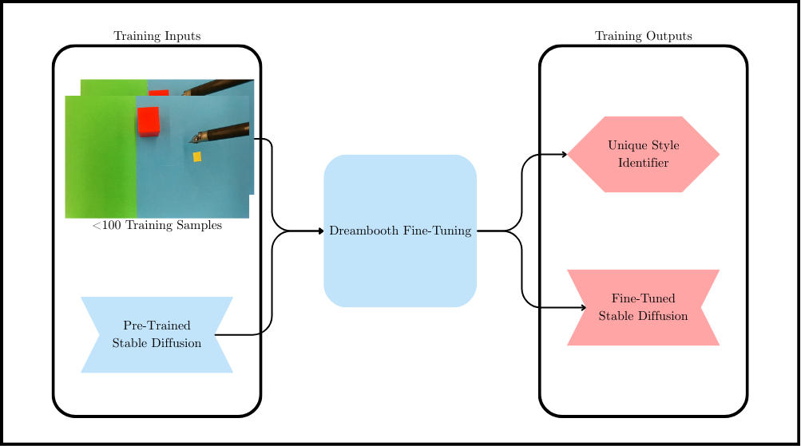
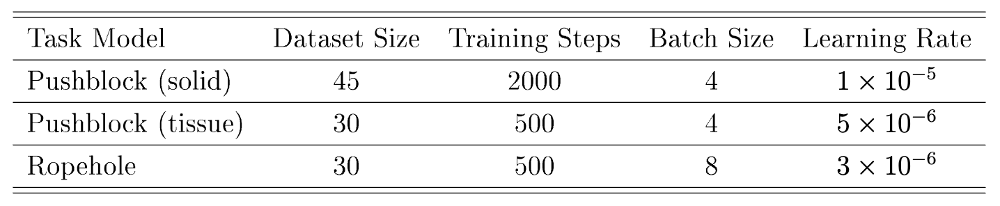
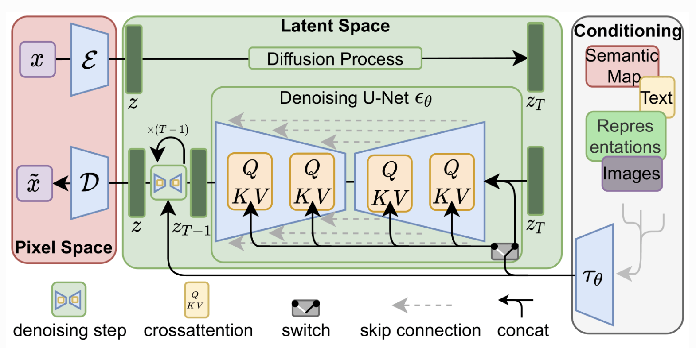
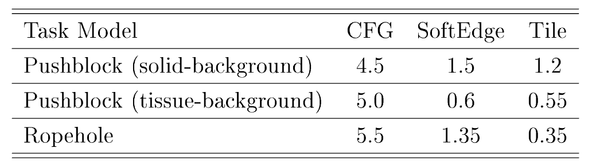
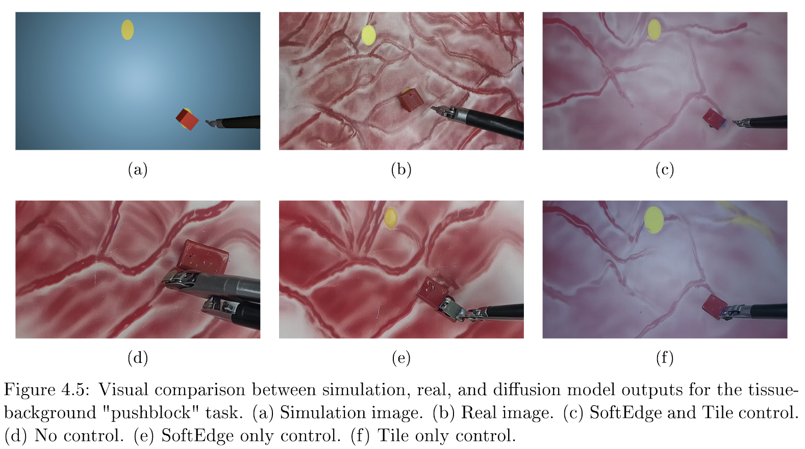
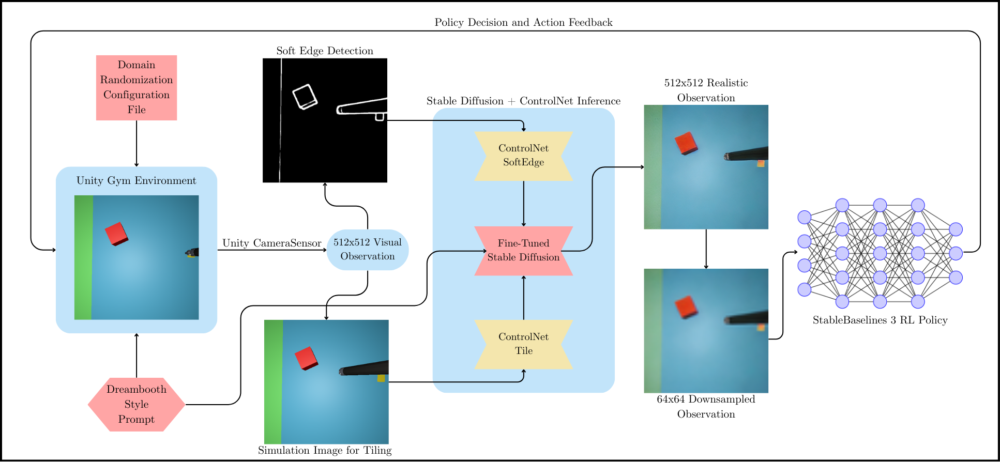

# Bridging the Sim-to-Real Gap for Surgical Robotic Manipulation Tasks Using Diffusion Models

This repository contains code and documentation for vision-based RL training of surgical robotic manipulation tasks using diffusion models. The goal is to leverage realistic synthetic data generated by diffusion models to improve the performance of vision-based RL agents in real-world environments when trained in Unity simulation. The project is part of my undergraduate thesis at the University of Toronto, supervised by Lueder Kahrs at the Medical Computer Vision and Robotics Lab (MEDCVR). The complete thesis document is available in the root directory of this repository, titled `Thesis_EthanRajah.pdf`.
The project is divided into several key components:
- **Diffusion Image Generation and Evaluation**: Training and evaluating fine-tuned diffusion models to generate high-quality images of surgical tasks.
- **Diffusion-Based RL Training**: Training reinforcement learning agents using the generated images as input.
- **Sim-to-Real Transfer**: Limitations and techniques for transferring learned diffusion-based policies from simulation to real-world environments.

## Diffusion Image Generation

<!-- Describe how training data is collected and prepared -->
### Dataset Preparation & Training Pipeline
DreamBooth is used to fine-tune diffusion models on a dataset of surgical images. The dataset is collected from demonstration videos of the dVRK surgical robot performing a tissue manipulation task and thread placement task. Due to the low number of images required for DreamBooth fine-tuning, 30-50 images are carefully
selected from the videos, performing random cropping and augmentation to create a diverse dataset of the real-world task image distribution. Based on the task, the
dataset is associated with a specific prompt to guide the diffusion model in generating images that closely resemble the real-world task without causing catastrophic forgetting of the original model. Three datasets are created for the two tasks: (1) solid-background tissue manipulation, (2) tissue-background tissue manipulation, and (3) thread placement. Each dataset is separately fine-tuned with Stable Diffusion v1.5 using DreamBooth. The dataset preprocessing pipeline is provided in the `preprocessing/preprocess.py` file. Futhermore, the training steps are highlighted in the `training/train_dreambooth_commands.ipynb` notebook. The following images show the training pipeline and the optimal hyperparameters used for the fine-tuning process.



The models are trained using the Compute Canada cluster, using an NVIDIA A100 GPU instance with 20GB of VRAM. The training process takes approximately 20 minutes per model, allowing for efficient hyperparameter tuning and experimentation. The size of the training datasets are also optimized due to the sensitivity of DreamBooth to the number of training images and its diversity.
The primary training script is located in the `training/train_dreambooth.py` file, which contains the code for fine-tuning the diffusion model using DreamBooth. A version of this script for lower VRAM GPUs (i.e., my 3070 with 8GB of VRAM) makes use of DeepSpeed, a library for optimizing the training of large models. This script is located in the `training/train_dreambooth_deepspeed.py` file.



<!-- Describe the model architecture and config -->
### Model Architecture
The diffusion model used is Stable Diffusion v1.5, which is a latent diffusion model that generates high-quality images from text prompts. The model is fine-tuned using DreamBooth, which allows for personalized image generation based on a small number of training images.
Diffusion models are a class of generative models that learn to generate images by iteratively denoising random noise. They are trained using a diffusion process that gradually adds noise to the training images, and then learns to reverse this process to recover the original images. The autoregressive process of predicting noise at each step (making use of the Markov assumption), allows for implicit learning of the entire image distribution.
The model architecture consists of a U-Net backbone with attention mechanisms, which enables it to capture complex patterns and details in the images. The model is trained using an L2 loss to ensure high-quality image generation.



ControlNet is also used to condition the diffusion model on the task-specific prompts, allowing for more controlled image generation. The ControlNet architecture is integrated into the diffusion model to enhance the quality and diversity of the generated images. SoftEdge and Tile controlnets are used together to improve the quality of the generated images by providing additional conditioning information. The SoftEdge control model uses edges detected with Pidinet as conditioning for preserving the original edges seen in simulation. The Tile control model uses a downsampled version of the input simulation image as conditioning and internally splits the image into small tiles during processing to guide the diffusion model in generating realistic textures and details. The use of ControlNet ensures that key pose features are preserved in the generated images, which is crucial for use in RL training.

<!-- Describe how the inference process is optimized for real-time performance -->
## Inference Optimization
The quality of diffusion generations are highly dependent on the number of denoising steps used during inference, as well as the ControlNet conditioning strengths. Optimizing these parameters is essential for achieving real-time performance in practical applications. Additionally, implementing adaptive denoising strategies can further enhance the efficiency of the inference process, allowing for quicker response times in dynamic environments. While the `inference/inference.py` script provides a detailed implementation of the inference process, it is important to note that the performance may vary based on the specific hardware and software configurations used. The inference process is optimized for real-time performance by leveraging GPU acceleration and efficient memory management techniques. The `inference/inference.py` script includes options for adjusting the number of denoising steps and ControlNet conditioning strengths, allowing users to experiment with different settings to achieve the desired balance between image quality and inference speed. The following image shows the optimized inference parameters, assessed by visual inspection of the generated images.



The conditioning strengths determine how much weighting to apply to the condition images when generating the final output, while the CFG scale determines how strongly the diffusion model adheres to the text prompt versus its own learned biases and priors. Inference is done with 20 denoising steps with $512x512$ simulation input images, making use of the UniPCMultistep noise scheduler and xFormers, a memory-efficient attention implementation used to reduce memory consumption and
increase speed during inference.

<!-- Optional: Evaluation techniques -->
### Evaluation
The evaluation of the diffusion model is performed using a combination of qualitative and quantitative metrics. Qualitative evaluation involves visual inspection of the generated images to assess their quality and realism. Quantitative evaluation includes metrics such as FID (Fréchet Inception Distance) and KID (Kernel Inception Distance) to measure the diversity and quality of the generated images compared to the real-world dataset. The trained diffusion models are used to generate 500 images for each task using 500 random images from a Unity simulation. The generated images are then evaluated using the FID and KID metrics, which are calculated using the `evaluation/compute_fid_kid.py` script. 

As a baseline, the FID and KID scores are also calculated for the default simulation images used as input to the diffusion model for inference, and the results are compared to the generated images. The real-world images used for the metric computation are randomly selected from a test set of 10000 images extracted from the dVRK demonstration videos. Overall, we find that the diffusion model is able to generate high-quality images that closely resemble the real-world images, as evidenced by the low FID and KID scores, in comparison to the default simulation images.
The following image shows a comparison of generated images with the real-world images, demonstrating the effectiveness of the fine-tuned diffusion model integrated with ControlNet, for generating realistic images for surgical tasks.



The diffusion model is able to generate realistic images that closely resemble the distribution of the real-world images, generating outputs that preserve the key semantic features of the task based on the simulation inputs, while introducing reflections, textures, and other details that are not present in the simulation images.

## Diffusion-Based RL Training

The fine-tuned diffusion models are used to generate realistic simulation images for training reinforcement learning agents. This aims to bridge the sim-to-real gap by improving policy generalization and robustness in real-world environments through the introduction of noise and variability in the policy observations. While ML-Agents is commonly used for training RL agents in Unity, a custom training pipeline is designed to facilitate the integration of diffusion-generated images into the training process. The custom pipeline allows for seamless integration of the diffusion model with the RL training loop, enabling the generation of high-quality images on-the-fly during training. The RL training process is designed to be modular and extensible, allowing for easy experimentation with different RL algorithms and hyperparameters. An overview of the training pipeline is shown below:



<!-- Environment setup and agent configuration -->
### Environment Setup
Gymnasium/Gym is used to create a custom RL training pipeline that integrates with the Unity simulation environment. Gymnasium is a popular library for developing and testing RL algorithms, providing a standardized interface for creating and managing environments. Stable Baselines3 is used as the RL library for training agents, providing a collection of state-of-the-art RL algorithms and utilities for training and evaluating RL agents. While the pipeline supports various RL algorithms, the focus is on using Proximal Policy Optimization (PPO) and Soft Actor-Critic (SAC) for training agents. The ML-Agents library provides a Gym-compatible wrapper for Unity environments, enabling the use of Gymnasium's API to interact with the Unity simulation through Python.

<!-- RL algorithm and training loop details -->
### Training Pipeline
The core classes required for diffusion-based RL training are implemented in the `rl_pipeline/unity_gym.py` file. Users can configure their run (hyperparameters, diffusion model, Unity task, etc) by modifying the main block of the file, but future versions will include a separate configuration file and WandB integration for easier setup and monitoring.

#### UnityGymPipeline Class
The `UnityGymPipeline` class is responsible for managing the RL training pipeline, including environment setup, agent configuration, and training loop. It provides methods for initializing the environment, resetting the simulation, stepping through the environment during training, and performing inference with the trained agent. The pipeline supports domain randomization using an input yaml configuration file (see `rl_pipeline/DiffusionPushBlock_full_dr.yaml`), allowing users to specify lighting conditions, object colors, physics parameters, and other environment settings in Python, which are then sent to the Unity build for configuration prior to the 
environment being launched. This is implemented in the `create_env` function of the `UnityGymPipeline` class.

<!-- Code snippet for create_env function -->
```python
def create_env(self):
        """Create a Unity environment based on the class path and wrap it in a gym environment for training"""
        # Load YAML configuration for Unity environment to be used for domain randomization
        config = load_config(self.yaml_config)
        # Configure timescale for Unity environment
        channel = EngineConfigurationChannel()
        channel.set_configuration_parameters(time_scale = self.timescale)
        # Configure domain randomization parameters for Unity environment
        param_channel = EnvironmentParametersChannel()
        for k, v in config.items():
            if k == 'environment_parameters':
                for k2, v2 in v.items():
                    # Ensure that sampler_type and sampler_parameters are present in the YAML configuration
                    if 'sampler_type' not in v2 or 'sampler_parameters' not in v2:
                        raise ValueError("Invalid YAML configuration. Must have 'sampler_type' and 'sampler_parameters' keys.")
                    print(f"Setting parameter {k2} to {v2}...")
                    if v2['sampler_type'] == 'uniform':
                        # Check if min and max values are present. If so use set_uniform_sampler_parameters from mlagents
                        if 'min_value' in v2['sampler_parameters'] and 'max_value' in v2['sampler_parameters']:
                            param_channel.set_uniform_sampler_parameters(k2, v2['sampler_parameters']['min_value'], v2['sampler_parameters']['max_value'], self.seed)
                        else:
                            param_channel.set_float_parameter(k2, v2['sampler_parameters']['value'])
                    else:
                        raise Warning("Parameter not being set for domain randomization. Only uniform sampler type is supported.")
        # Create Unity environment and wrap it in a Gym environment
        unity_env = UnityEnvironment(self.env_path, side_channels=[channel, param_channel], base_port=self.base_port)
        gym_env = UnityToGymWrapper(unity_env)
        # Wrap the environment in a custom observation wrapper for diffusion inference and load pipeline
        self.env = DiffusionPipeline(gym_env, self.diffusion_model, self.diffusion_prompt, self.out_type, self.control_condition, self.guidance_scale, self.denoise, self.rl_res, self.log_dir)
```

The `train_ppo` and `train_sac` methods are used to train the Stable Baselines3 PPO and SAC agents, respectively. These functions consist of policy hyperparameter setting, checkpoint saving, and the learning loop, which implicitly uses the `step` method to step through the environment and collect observations and rewards.
Note that ML-Agents only creates a Gym-compatible wrapper for the Unity environment, but Stable Baselines3 relies on the OpenAI Gymnasium library, an updated version of OpenAI Gym, for training RL agents. The key difference that tends to break compatibility is that the `step` method in Gym returns a tuple of observations, rewards, done flags, and information dictionaries (4 items), whereas the Gymnasium version returns a tuple of observations, rewards, termination flags, truncation flags, and information dictionaries (5 items). The `_step` method in the `UnityGymPipeline` class is modified to return the correct number of items, ensuring compatibility with both Gym and Gymnasium. A `GymV21Compatibility` class is also implemented to handle this difference during Stable Baselines3 training.

```python
def train_ppo(self, resume=False):
        """Train a PPO policy using the Unity-Gym environment"""
        # Create a monitoring wrapper for the environment
        monitor_dump_dir = os.path.join(self.log_dir, f'ppo_{self.diffusion_prompt}_tensorboard')
        os.makedirs(monitor_dump_dir, exist_ok=True)
        # Set n_steps to 5 for smaller step training - useful for initial testing
        if not resume:
            model = PPO('CnnPolicy', self.env, verbose=1, tensorboard_log=monitor_dump_dir, stats_window_size=50, batch_size=256, n_steps=10240, n_epochs=3)
        else:
            # Resume training from latest checkpoint
            ckpt_files = [f for f in os.listdir(self.log_dir) if 'unity_rl_ckpt' in f]
            ckpt_files = [os.path.join(self.log_dir, f) for f in ckpt_files]
            if len(ckpt_files) == 0:
                raise FileNotFoundError("No checkpoint files found in log directory to resume from.")
            latest_ckpt = max(ckpt_files, key=os.path.getctime)
            model = PPO.load(latest_ckpt, env=self.env)
            model.verbose = 1
            model._stats_window_size = 50
            model.tensorboard_log = monitor_dump_dir
            # Load logger object for tensorboard logging
            logger = configure(monitor_dump_dir, ['tensorboard'])
            model.set_logger(logger)
        # Configure training for the PPO model
        checkpoint_callback = CheckpointCallback(save_freq=5000, save_path=self.log_dir, name_prefix="unity_rl_ckpt", save_replay_buffer=True, save_vecnormalize=True, verbose=1)
        # Train model
        model.learn(total_timesteps=self.timesteps, progress_bar=True, callback=checkpoint_callback, reset_num_timesteps=False)
        # Save model
        model_save = os.path.join(self.log_dir, 'unity_model')
        model.save(model_save)
        return model
```

#### DiffusionPipeline Class
The `DiffusionPipeline` class is an observation wrapper that integrates the diffusion model with the RL training pipeline. It initializes the diffusion model, along with the ControlNet conditioning models and hyperparameters based on the inputs to the pipeline and performs inference on the observed simulation image at each step. The `gym.ObservationWrapper` superclass is used, allowing for the `DiffusionPipeline` `observation` method to be called automatically during the training loop to augment the simulation image observations at each step with diffusion inference. More specifically, the `observation` method takes the simulation image as input, performs inference with the diffusion model, and returns the generated image as the new observation. Since the observation wrapper is used for each simulation step during RL training, the observation space must be specified in the `__init__` method of the `DiffusionPipeline` class. The observation space is set to a `Box` space with the shape of the generated image, which is $3x512x512$ for RGB images. Visual observations are provided in a channel-height-width format, which is the default format for Stable Baselines3. If multiple images are observed at each step (i.e., for stereo RL training), the observation space Box shape would need to be adjusted accordingly.

```python
    def observation(self, obs):
        """
        Automatic processing function of incoming observations.
        Convert observation to (H, W, C) form, with 0-255 pixel values from normalized 0-1 values and transform to Image object for diffusion processing.
        """
        # Preprocess Box observation to Image object
        obs = np.transpose(obs, (1, 2, 0))
        obs_img = (obs * 255).astype(np.uint8)
        obs_img = Image.fromarray(obs_img)
        if not self.no_diffusion:
            # Resample and resize image for tile control
            resolution = obs_img.size[0]
            tile_condition_img = self.resize_for_condition_image(obs_img, resolution)
            # Generate PIDI edge mask for softedge control
            edge_condition_image = self.mask_processor(obs_img, safe=True, image_resolution=resolution, detect_resolution=resolution)
            # Run inference using pipeline
            control_images = [tile_condition_img, edge_condition_image]
            if self.out_type == 'latent':
                # Return latent output for RL training. This is pre-decoded from the diffusion model.
                output_image = self.pipe(self.prompt, control_images, num_inference_steps=10, 
                                        generator=self.generator, controlnet_conditioning_scale=self.control_condition, 
                                        guidance_scale=self.guidance_scale, output_type="latent").images[0]
            else:
                # Return decoded image output for RL training
                output_image = self.pipe(self.prompt, control_images, num_inference_steps=10, 
                                        generator=self.generator, controlnet_conditioning_scale=self.control_condition, 
                                        guidance_scale=self.guidance_scale).images[0]
        else:
            # No diffusion processing was set to True, return original observation in RGB format
            output_image = obs_img
        # Post process output based on out_type and return augmented observation
        aug_obs = self.post_process_image_output(output_image)
        # Save observation image for validation
        # self.save_obs_img(aug_obs, self.log_dir)
        return aug_obs
```

### Sim-to-Real Transfer
The trained dVRK RL policy is converted to ONNX using the `rl_pipeline/sb3_to_onnx.py` script and deployed on the real dVRK robot using a custom ROS control framework developed by the MEDCVR lab. Although diffusion provides realistic simulation images for RL training, there is a major bottleneck on training time due to the slow denoising process when running inference on each simulation observation, even with a reduced number of denoising steps (10). The number of denoising steps cannot be reduced any further without significantly degrading the quality of the generated images, which would defeat the purpose of using diffusion for RL training. A complete timing analysis is provided in the thesis document, assessing inference time and performance using various input and output image resolutions. ONNX versions of the fine-tuned diffusion models are also created to experiment with potential optimizations for inference speed, but even with IO binding implementation for ONNX inference, the memory transfer overhead between CPU and GPU when profiling is significant, causing a slowdown in inference time.

Current work is focused on optimizing the diffusion-based RL training pipeline using InstaFlow, a method for one-step denoising of diffusion models. This requires LoRA fine-tuning of the diffusion model because the one-step reflow method is trained on Stable Diffusion v1.5 weights, meaning fine-tuning the InstaFlow model after this training is done will cause noisy outputs unless reflow training is performed again afterwards (which is very computationally expensive). More information is provided on the InstaFlow GitHub repository.

